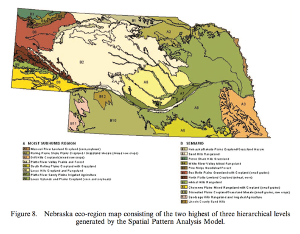
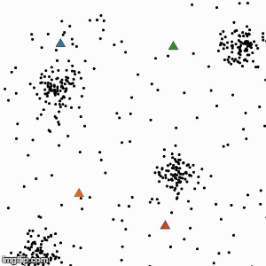
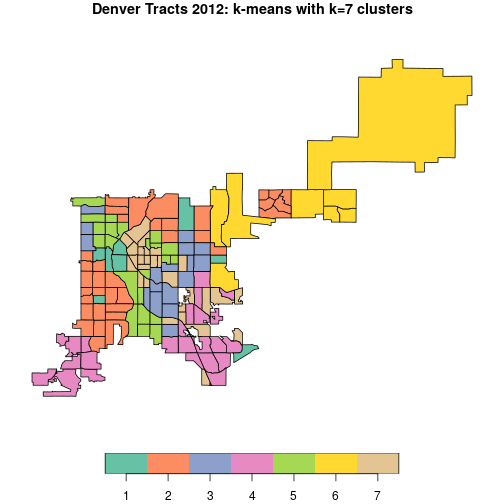
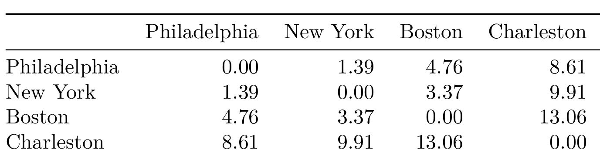
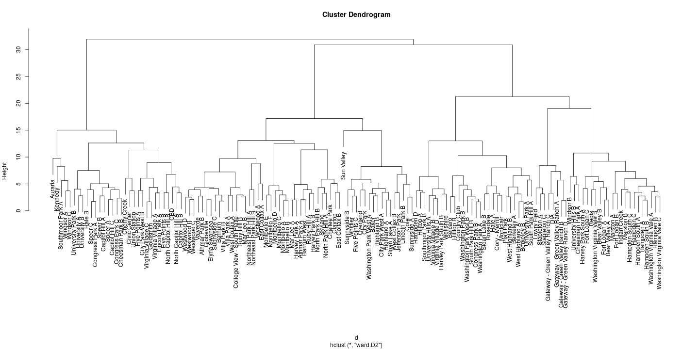

Cluster Analysis
========================================================
autosize: true
width: 1600
height: 1000
Guest Lecturer: Joe Tuccillo

GEOG 4023/5023 - Quantitative Methods  
Spring 2020

<style>
.small-code pre code {
  font-size: 1.1em;
}
</style>


Introduction
===
- Classification involves using data to group places, events, things into types.
- In geography we are often interested classifying places into regions. 
- A "gentrifying neighborhood” evokes a multidimensional picture of a place. 

Cluster Analysis vs. an Atlas
===
- Traditionally geographers would explore multivariate spatial data by producing an atlas. 
- Each page of the atlas would describe a single variable (e.g. income, homeownership, third-wave coffee shop density, dog salons per capita...).
- We could to identify “gentrifying” neighborhoods by cross referencing maps.

Cluster Analysis vs. an Atlas
===
- However, as our data grew in complexity the task of identifying interesting patterns in the data would become more complex. 
- If we had 50 variables we would need to have an atlas with at least 50 pages.
- We would have to cross reference many maps. Identifying patterns would be difficult.

Cluster Analysis vs. an Atlas
===
- Cluster Analysis is a set of statistical techniques to let people “discover” groups in data. 
- What you could do visually in 2 or 3 dimensions cluster analysis does in high dimensions.
- Each data point is labeled by group membership. 
- Each cluster has an **attribute profile**...kind of like a "bookmarked" set of atlas pages that best describe places in that cluster.

Example
===
<center>

<font size="4"><center>(Singleton and Spielman 2015)</center></font>
</center>

Geographic Cluster Analysis
===
- Cluster analysis joins areas that are close together in “attribute space".
- We might want to add a spatial constraint to this process.
- Cluster analysis with a spatial constraint is sometimes called **regionalization**.

Regionalization Example
===
<center>

</center>

Space-Time Clustering
===
We can also use cluster analysis to describe how places change over time: 
<center>

</center>
<font size="4"><center>https://github.com/jvtcl/covid19-co</center></font>
</center>

===
<center>
     
<p style="padding: 20% 0;font-size:56px;font-weight:bold;color:#212185">Clustering Basics</p>

</center>


Clusters in Attribute Space
===

- Clusters are sometimes visually obvious in high-density regions of the "attribute space".
- High-density regions = lots of mutual nearest-neighbors.
- We can also describe each cluster's members as being closer to a "central" or "exemplary" observation than any other. 

***


Clustering Around Centroids: K-Means
===

1. Randomly place *k* number of points (centroids) in the attribute space. 
2. Each dot (observation) is assigned to the nearest centroid.
3. Centroid is recalculated as the mean center of the points assigned to it. 
4. Repeat steps 2 - 3 until "convergence" (centroids stop moving).

***



K-Means Example: Denver Census Tracts
===
type:small-code


```r
## remove geographic identifiers, x/y coords, 
## and test variable (health insurance coverage) from cluster inputs
clust_vars <- names(den)[!names(den) %in% c('GEOID', 'Nghbrhd', 'id_nbh', 'INTPTLA', 'INTPTLO', 'Hlth_Un', 'Hlth_In')]

## generate clustering input dataframe
clust_dat <- den@data[,clust_vars]

## standardize (z-score) cluster inputs
clust_dat_z <- scale(clust_dat)

## perform k-means clustering and extract group labels
set.seed(909)
den_clust <- kmeans(clust_dat_z, centers = 7)
kmclust <- factor(den_clust$cluster)
```

***



===
<center>
     
<p style="padding: 20% 0;font-size:56px;font-weight:bold;color:#212185">Clustering by (Dis)similarity</p>

</center>


Clustering by (Dis)similarity
===
- A **dissimilarity matrix** is like a "mileage chart" for our data.
- An **affinity matrix** is like the inverse of a mileage chart (proximity, nearest neighbors).

*** 



Clustering by (Dis)similarity
===
- The choice of dissimilarity vs. affinity depends on the clustering method.
  - Some methods work to _distinguish features_ in the data (dissimilarity). 
  - Other methods work to find _mutual similarities_ (affinity).  

*** 


Clustering by (Dis)similarity
===
- Dissimilarity/affinity matrices can be built from: 
    - **Continuous** data (i.e. Euclidean or Manhattan distance)
    - **Categorical** data (i.e. Matching or Jaccard distance)
    - **Mixed-type** data (i.e. Gower distance)
    
Hierarchical Clustering 
===
- Use dissimilarities to organize data into a **dendrogram**, a tree-like diagram.
  - The "leaves" describe individual observations.
  - The "stems" describe more specific clusters.
  - The "branches" describe more general clusters.
- Clusters are found by "cutting" the dendrogram at a desired height of $k$. 
  
***


Hierarchical Clustering: Linking/Sorting Strategies
===
- Distance-based: merge the groups *closest* on some criterion
  - **Single linkage** (nearest-neighbor)
  - **Complete linkage** (furthest-neighbor)
  - **Average linkage** (centroid)
- Variance-based: **Ward's Method**
  - Each merge minimizes the "error sum of squares" (ESS), a measure of within-cluster dissimilarity.
  
***


  
A Dendrogram of Denver Tracts
===
type: small-code
- Generate a euclidean distance matrix using R's `dist` function.
- Generate a dendrogram from the distance matrix using R's `hclust` function.
- Use the _Ward_ linkage method (minimize within-cluster variance).

***

```r
## add neighborhood ids to rownames for readability
rownames(clust_dat_z) <- den$id_nbh

## generate distance matrix
d <- dist(clust_dat_z)

## ward dendrogram
dend <- hclust(d = d, method = 'ward.D2')
```

A Dendrogram of Denver Tracts
===
<center>

</center>

Finding a Suitable k
===
- We still need to identify a suitable number of clusters $k$ at which to cut the dendrogram.
- Clusters should be **internally consistent** and **well separated**.
- Often useful to consider variance-based and separation-based criteria.
- Can iterate *k* groups and measure each of these criteria to find a "best" solution.

Finding a Suitable k: Variance-Based Criteria
===
<center>
$$GVF = \frac{BSS}{TSS}$$

where 

$$TSS = BSS + WSS$$
</center>

***

Sometimes called **Goodness of Variance Fit (GVF)**.
- **Total Sum of Squares (TSS)**: sum of squared distances from data centroid
- **Between Sum of Squares (BSS)**: sum of squared distances between all group centroids and the data centroid
- **Within Sum of Squares (WSS)**: sum of squared distances between all group members and their centroid

Finding a Suitable k: Variance-Based Criteria
===
<center>
$$GVF = \frac{BSS}{TSS}$$

where 

$$TSS = BSS + WSS$$
</center>

***

Look familiar? 
- This is kind of like an R^2 statistic for clustering.
- Instead of a "line of best fit", we have cluster centroids.
- Instead of "fitted values", we have cluster labels.
- The "explained" part (BSS) tells us how distinct from data centroid the cluster centroids are.
- The "unexplained" part (WSS) tells us how much observations vary about their own centroid.

Finding a Suitable k: Separation-Based Criteria
===
### Information provided by each cluster should be distinct, and shared as little as possible with other clusters.

In other words, clusters should be **well separated**. cases should be grouped:
  - _With_ others _like them_,
  - _Apart from_ those _unlike them_.

Finding a Suitable k: Separation-Based Criteria
===
- **Average Silhouette Width:** to what degree do clusters overlap?
  - 0 = high overlap
  - 1 = high separation
  - -1 = incorrect labels.

Selecting k for Denver Tracts
===
type: small-code

1. Specify a desired range of cluster numbers (here $k=3...10$).
2. Cut the dendogram at each `k` and...
  - Compute variance-based measure (Goodness of Variance Fit).
  - Compute separation-based measure (Average Silhouette Width in R library `cluster`).
4. Compare the measures visually and identify an optimal solution.

***


```r
## Specify a range of cluster numbers
krange <- 3:10

# goodness of variance fit
gvf <- sapply(krange, function(k){
  
  kclust = cutree(dend, k)
  fastClusterGVF(dat = clust_dat, clust = kclust)
  
})

# average silhouette width
sil <- sapply(krange, function(k){
  
  kclust = cutree(dend, k)
  mean(silhouette(x = kclust, dist = d)[,3])
  
})
```

Selecting k for Denver Tracts
===

<center>

</center>

***

<left>

|  k|  gvf|  sil|
|--:|----:|----:|
|  3| 0.25| 0.15|
|  4| 0.25| 0.15|
|  5| 0.26| 0.15|
|  6| 0.28| 0.14|
|  7| 0.28| 0.15|
|  8| 0.29| 0.14|
|  9| 0.29| 0.13|
| 10| 0.30| 0.13|
</left>

Map the Clusters
===
type: small-code

```r
## cut dendrogram at best k
best_k <- 7

## assign it to the map data
den_map['cluster'] <- dend %>% 
                      cutree(best_k) %>% 
                      factor
```

```r
## plot the map
plot(den_map['cluster'],main = paste('Denver Tracts 2012: k =',best_k,'clusters'))
```

***


Examining the Clusters
===
#### A-Priori Knowledge
- How well do the clusters match with prior understanding of the problem of interest?
  - e.g. Tracts in Downtown Denver are probably distinct from the rest of the city.
- How well do the clusters suit the objectives of the analysis? 
  - e.g. Revealing different types of "social vulnerability" across neighborhoods.
  
Examining the Clusters
===
#### External Validation
- **External measures** or a **"ground-truth"** can also be useful.
- Do the clusters align well with a particular outcome?
  - e.g. Are crime events concentrated more heavily in one cluster than others?
- Do the clusters match a "ground truth" well?
  - e.g. prior findings from a field assessment.

Comparing the Denver Tract Clusters to an External Measure
===
<center>


***


</center>

Profiling Clusters
===
<center>
An **average profile** plot tells us how far above/below the data mean a cluster is on the input variables:  


</center>

===
<center>
     
<p style="padding: 20% 0;font-size:56px;font-weight:bold;color:#212185">Clustering with Principal Components Analylsis (PCA)</p>

</center>


Clustering with Principal Components Analylsis (PCA)
===
- PCA performs a linear transformation of the data based on covariances among the input features.
- In the "PCA space", cases are organized around **latent constructs** (i.e., "gentrification", "hardship", "aging") represented by each PCA dimension. 
- Clustering is performed on these latent constructs rather than directly on the input features.

PCA for Denver Tracts
===
type: small-code


```r
## build the PCA inputs
pca_in <- den@data[,c('Hlth_Un', clust_vars)]
rownames(pca_in) <- den$id_nbh # assign neighborhood IDs

# perform PCA 
pca <- PCA(pca_in,
           scale.unit = T, # z-scores handled internally
           quanti.sup = 1, # use `no health ins.` as an external var
           ncp = 2, # only keep first 2 principal components
           graph = F) 
```

PCA for Denver Tracts
===

***
- **Dimension 1: Socioeconomic Status** 
Above Poverty/Homeowners -> Below Poverty/Renters
- **Dimension 2: Youth/Domesticity** 
via Race/Ethnicity, SES, Housing Density.

PCA for Denver Tracts
===


***


Clustering in PCA Space
===
type: small-code
1. Extract PCA scores (projections of the Denver tracts). 
2. Compute Euclidean distances on the scaled PCA scores.
3. Perform Ward Hierarchical Clustering using $k$ = 7 clusters again (for comparison's sake).

***

```r
## extract PCA scores (projections of each case)
pca.scores <- pca$ind$coord %>% 
              scale %>% 
              data.frame

## cluster using Ward's method
clust_pca <- pca.scores %>% 
             dist %>% 
             hclust(method = 'ward.D2') %>% 
             cutree(k = 7) %>% 
             factor # for plotting
```

Clustering in PCA Space
===


***


To PC or not to PC?
===
- When clustering, **use PCA with caution!**
- PCA is useful to develop a "high level" understanding of the data...
- ...but the PCA scores can also oversimplify relationships among places.  

===
<center>
     
<p style="padding: 20% 0;font-size:56px;font-weight:bold;color:#212185">More Clustering Methods</p>

</center>


More Clustering Methods
===
### Some methods handle selection of $k$ themselves...
  - **Density: Mutual Neighbors** (Community Detection)
  - **Density: Radius Neighbors** (DBSCAN)
  - **Around _Exemplars_** (Affinity Propagation) 
  
_Tradeoff_: Sometimes these methods generate a lot of unclassified observations or "noise".


More Clustering Methods
===
### What if I have categorical data?
- Use **Model-Based** clustering techniques like **Latent Class Analysis (LCA)**!
- Model parameters are determined using maximum likelihood (similar to GLMs).
- Information-theoretic criteria (i.e. AIC, BIC) are used to find a suitable $k$.

More Clustering Methods
===
- Model-based clustering techniques also allow **multiple memberships** ("fuzzy" clusters)
- Availble for continuous data (`mclust`, `teigen`) and categorical data (`poLCA`, `bayesLCA`)

More Data Reduction Techniques
===
- **Multidimensional Scaling (MDS)** for _dissimilarities_.
- **Graph Decomposition (Spectral Analysis)** for _affinities_ or _nearest neighbors_.
- **Homogeneity Analysis/MCA** for _categorical data_.

Conclusion
===
#### Clustering is super flexible! There is no "one size fits all" approach. 

**Always design a cluster analysis with your own research aims in mind!**
  - Variable selection
  - Representation of data (i.e., data reduction, transformation)
  - Clustering methods and their objectives
  - Cluster validation/interpretation
