Lecture 20 - Cluster Analysis
========================================================
autosize: true
width: 1600
height: 1000

GEOG 4023/5023 - Quantitative Methods  
Spring 2018

<style>
.small-code pre code {
  font-size: 1em;
}
</style>


Introduction
===
<center>
## What is your neighborhood like?
</center>

Introduction
===
- Classification involves using data to group places, events, things into types.
- In geography we are often interested classifying places into regions. 
- A "gentrifying neighborhood” evokes multidimensional picture of a place. 

Cluster Analysis vs. an Atlas
===
- Traditionally geographers would explore multivariate spatial data by producing an atlas. 
- Each page of the atlas would describe a single variable (e.g. income, homeownership, third-wave coffee shop density, dog salons per capita...).
- We could to identify “gentrifying” neighborhoods by cross referencing maps.

Cluster Analysis vs. an Atlas
===
- However, as our data grew in complexity the task of identifying interesting patterns in the data would become more complex. 
- If we had 50 variables we would need to have an atlas with at least 50 pages.
- We would have to cross reference many maps. Identifying patterns would be difficult.

Cluster Analysis vs. an Atlas
===
- Cluster Analysis is a set of statistical techniques to let people “discover” groups in data. 
- What you could do visually in 2 or 3 dimensions cluster analysis does in high dimensions.
- Each data point is labeled by group membership. 
- Each cluster has an **attribute profile**...kind of like "bookmarking" a set of atlas pages that best describe places in that cluster.

Example
===
<center>
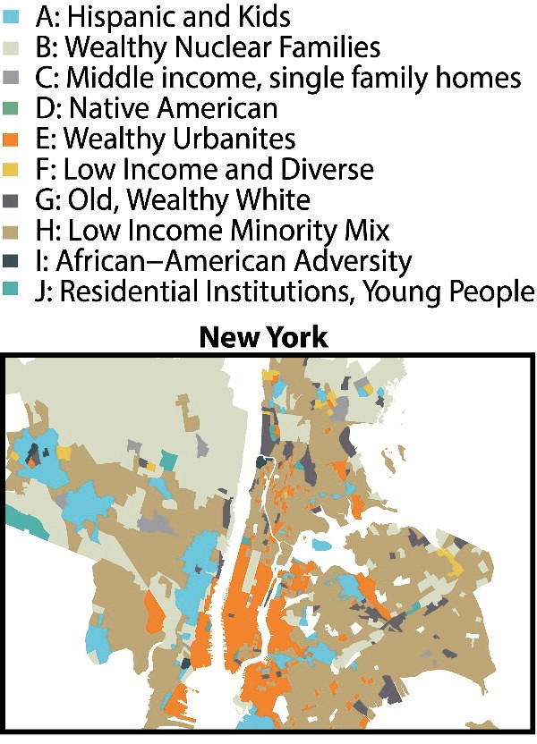
</center>

Geographic Cluster Analysis
===
- Cluster analysis joins areas that are close together in “attribute space".
- We could imagine wanting to add a spatial constraint to this process.
- Cluster analysis with a spatial constraint is sometimes called regionalization.

Regionalization Example
===
<center>
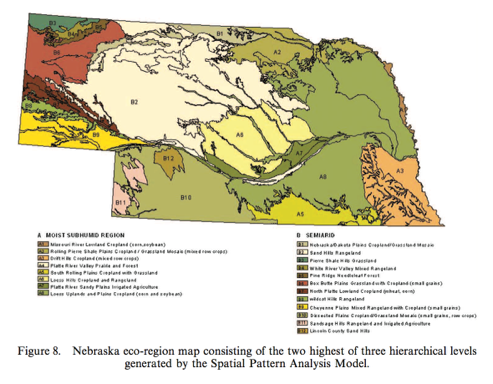
</center>

Space-Time Clustering
===
<center>
We can also use cluster analysis to describe how places change over time: 
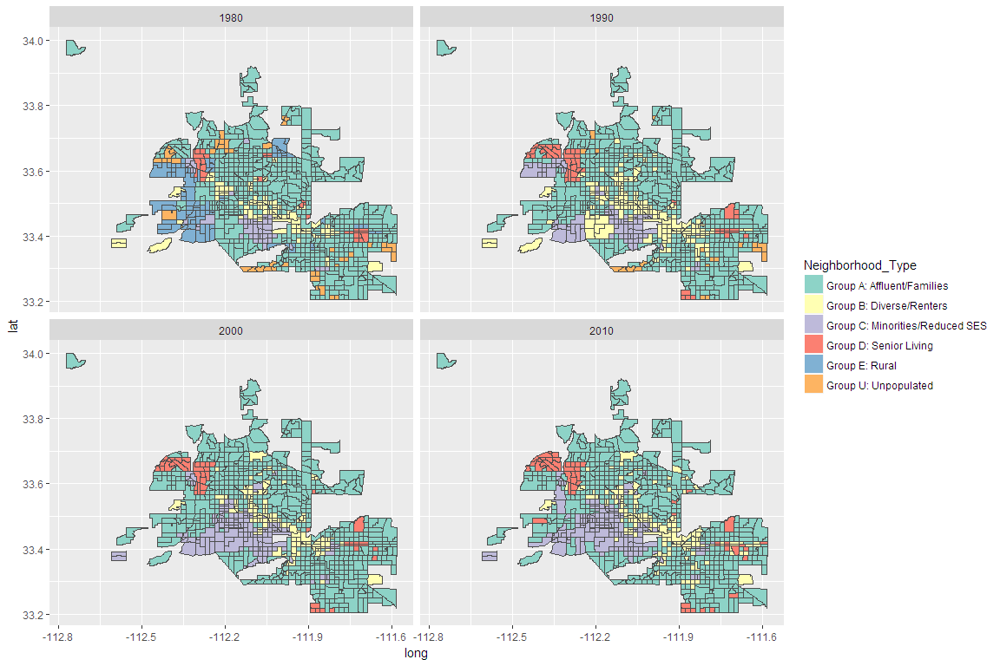

</center>

Space-Time Clustering
===
<center>
We can also use cluster analysis to describe how places change over time: 
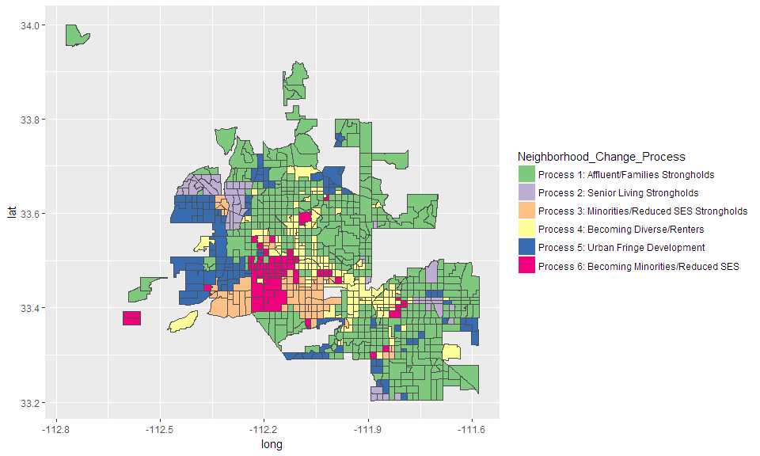
</center>

Clusters in Attribute Space
===

- Clusters are sometimes visually obvious in high-density regions of the "attribute space".
- High-density regions = lots of mutual nearest-neighbors.
- We can also describe each cluster's members as being closer to some "exemplar" or "centroid" than any other. 

***

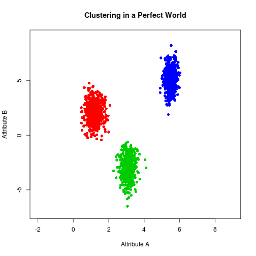

Clustering Around Centroids: K-Means
===

1. Randomly place *k* number of points (centroids) in the attribute space. 
2. Each dot (observation) is assigned to the nearest centroid.
3. Centroid is recalculated as the mean of the points assigned to it. 
4. Repeat steps 2 - 3 until "convergence" (centroids stop moving).

***

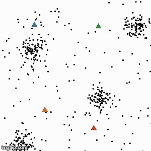

K-Means Example on "Real World" Data
===


```r
## remove geographic identifiers, x/y coords, 
## and test variable (health insurance coverage) from cluster inputs
clust_vars = names(den)[!names(den) %in% c('GEOID', 'Nghbrhd', 'INTPTLA', 'INTPTLO', 'Hlth_Un', 'Hlth_In')]

## generate clustering input dataframe
clust_dat = den@data[,clust_vars]

## standardize (z-score) cluster inputs
clust_dat_z = scale(clust_dat)

## perform clustering
set.seed(909)
kmclust = kmeans(clust_dat_z, centers = 7)$cluster # perform k-means and extract group labels
```

***


Clustering by (Dis)similarity
===
- A **dissimilarity matrix** is like a "mileage chart" for our data.
- An **affinity matrix** would be like inverse of a mileage chart (i.e. measuring _proximity_ by subtracting every distance from the max distance).
- Both measures support different clustering tasks.
  - e.g. hierarchical vs. nearest-neighbors clustering

*** 

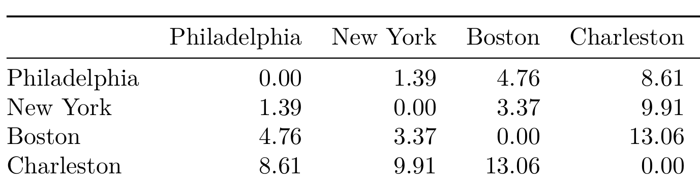

Clustering by (Dis)similarity
===
- Dissimilarity/affinity matrices can be built from: 
    - **Continuous** data (i.e. Euclidean or Manhattan distance)
    - **Categorical** data (i.e. Matching or Jaccard distance)
    - **Mixed-type** data (i.e. Gower distance)
    
Hierarchical Clustering 
===
- Use dissimilarities to organize data into a **dendrogram**, a tree-like diagram.
  - The "leaves" describe individual observations.
  - The "stems" describe more specific clusters.
  - The "branches" describe more general clusters.
- Clusters are recovered by "cutting" the dendrogram at a desired `k` or height. 
  
***


Hierarchical Clustering: Linking/Sorting Strategies
===
- Distance-based: merge the groups *closest* on some criterion
  - **Single linkage** (nearest-neighbor)
  - **Complete linkage** (furthest-neighbor)
  - **Average linkage** (centroid)
- Variance-based: **Ward's Method**
  - Each merge minimizes the "error sum of squares" (ESS), a measure of within-cluster dissimilarity.
  
A Dendrogram of Denver Tracts
===
- Generate a euclidean distance matrix using R's `dist` function.
- Generate a dendrogram from the distance matrix using R's `hclust` function.
- Use the _Ward_ linkage method (minimize within-cluster variance).

***

```r
## add neighborhood ids to rownames for readability
rownames(clust_dat_z) = den$Nghbrhd

## generate distance matrix
d = dist(clust_dat_z)

## ward dendrogram
dend = hclust(d = d, method = 'ward.D2')
```

A Dendrogram of Denver Tracts
===
<center>
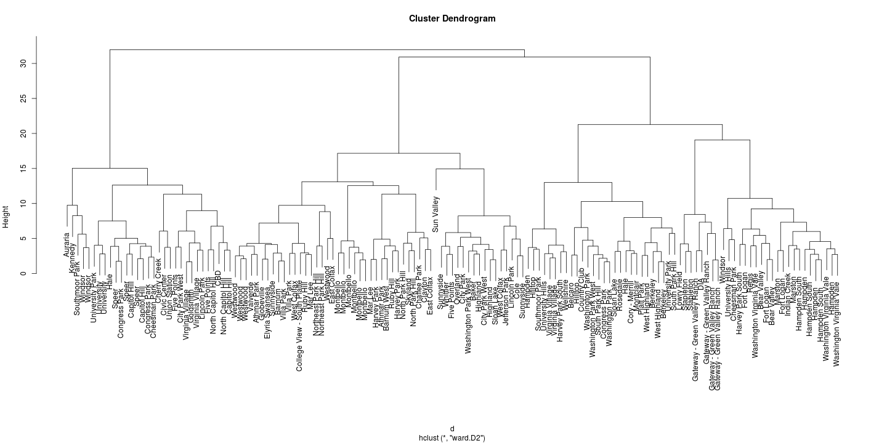
</center>

Finding a Suitable k 
===
- Clusters should be **internally consistent** and **well separated**.
- Often useful to consider variance-based and separation-based criteria.
- Can iterate *k* groups and measure each of these criteria to find a "best" solution.

Finding a Suitable k: Variance-Based Criteria
===
<center>
$$GOF = \frac{BSS}{TSS}$$

where 

$$TSS = BSS + WSS$$
</center>

***

Sometimes called **Goodness of Variance Fit (GOF)**.
- **Total Sum of Squares (TSS)**: sum of squared distances from data centroid
- **Between Sum of Squares (BSS)**: sum of squared distances between all group centroids and the data centroid
- **Within Sum of Squares (WSS)**: sum of squared distances between all group members and their centroid

Finding a Suitable k: Variance-Based Criteria
===
<center>
$$GOF = \frac{BSS}{TSS}$$

where 

$$TSS = BSS + WSS$$
</center>

***

Look familiar? 
- This is kind of like an R^2 diagnostic for clustering.
- Instead of a "line of best fit", we have cluster centroids.
- Instead of "fitted values", we have cluster labels.
- The "explained" part (BSS) tells us how distinct from data centroid the cluster centroids are.
- The "unexplained" part (WSS) tells us how much observations vary about their own centroid.

Finding a Suitable k: Separation-Based Criteria
===
- Clusters should be _well separated_: they should inhabit their own "high density" portions of the attribute space.
- Information provided by each cluster should be distinct, and shared as little as possible with other clusters.
- **Average Silhouette Width:** to what degree do clusters overlap?
  - 0 = high overlap
  - 1 = high separation
  - -1 = incorrect labels.

Selecting k for Denver Tracts
===
1. Specify a desired range of cluster numbers (here $k=3...10$).
2. Cut the dendogram at each `k` and...
  - Compute variance-based measure (Goodness of Variance Fit).
  - Compute separation-based measure (Average Silhouette Width in R library `cluster`).
4. Compare the measures visually and identify an optimal solution.

***


```r
## Specify a range of cluster numbers
krange = 3:10

# goodness of variance fit
gof = sapply(krange, function(k){
  
  kclust = cutree(dend, k)
  fastClusterGOF(dat = clust_dat, clust = kclust)
  
})

# average silhouette width
sil = sapply(krange, function(k){
  
  kclust = cutree(dend, k)
  mean(silhouette(x = kclust, dist = d)[,3])
  
})
```

Selecting k for Denver Tracts
===

<center>
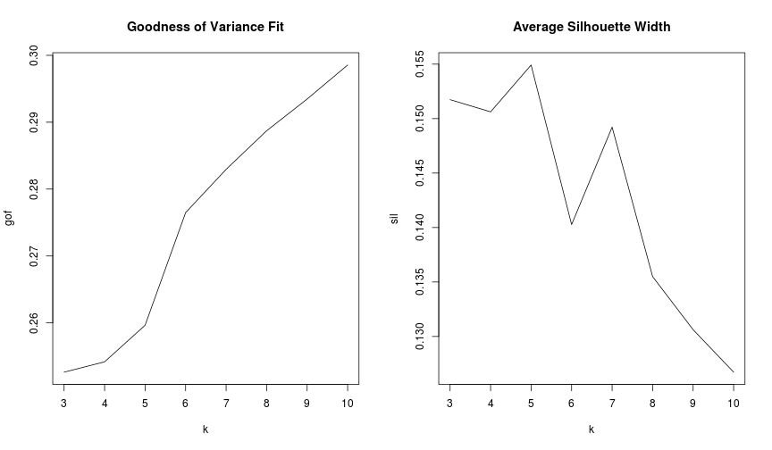
</center>

***

<left>

|  k|  gof|  sil|
|--:|----:|----:|
|  3| 0.25| 0.15|
|  4| 0.25| 0.15|
|  5| 0.26| 0.15|
|  6| 0.28| 0.14|
|  7| 0.28| 0.15|
|  8| 0.29| 0.14|
|  9| 0.29| 0.13|
| 10| 0.30| 0.13|
</left>

Map the Final Solution
===
<center>

```r
## cut dendrogram at best k and assign it to our sf object
best_k = 7
den_map['cluster'] = factor(cutree(dend, best_k))

## plot the map
plot(den_map['cluster'],main = paste('Denver Tracts 2012: k =',best_k,'clusters'))
```

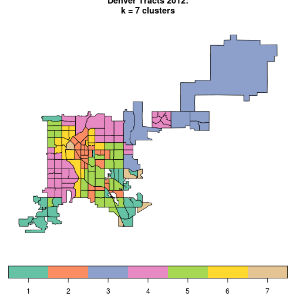
</center>

Interrogating the Clusters
===
- How well do the clusters match with prior expectations of data under analysis?
  - e.g. We know "Downtown Denver" is distinct from the rest of the city.
- How well do the clusters suit the objectives of the analysis? 
  - e.g. Revealing different "socially vulnerable" groups.
  
Interrograting the Clusters
===
### Outcome measures or a "ground-truth" can be useful.
- Do the clusters align well with a particular outcome?
  - e.g. Are flood losses concentrated more heavily in one cluster than others?
- Do the clusters match a "ground truth" well?
  - e.g. Observations/categories from a field assessment.

Comparing the Denver Tract Clusters to an Outcome Measure
===
<center>
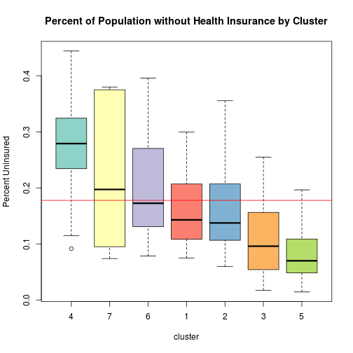

***

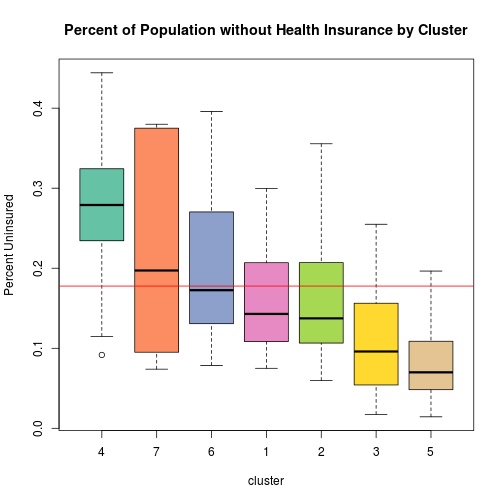
</center>

Profiling Clusters
===
<center>
An **average profile** plot tells us how far a above/below the data average a cluster is on variables of interest:  

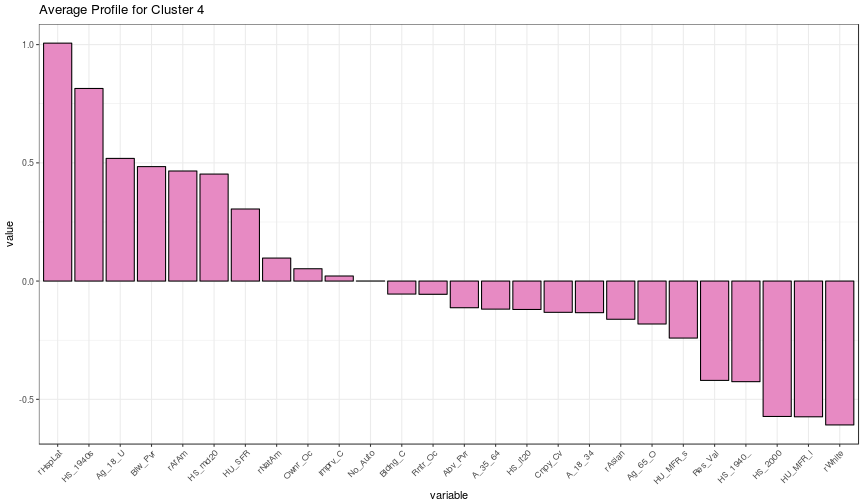
</center>

Side Notes: "Built-in" Selection of k
===
### Some methods handle selection of `k` themselves...
  - **Mutual nearest-neighbors** (Community Detection)
  - **Threshold distance neighbors** (DBSCAN)
  - **Mutual similarity to an exemplar** (Affinity Propagation) 
  
_Tradeoff_: Sometimes these methods generate a lot of "singletons" or noise.


Side Notes: Clustering Categorical Data
===
- Useful for grouping e.g. survey responses.
- Uses "model-based" clustering techniques like **Latent Class Analysis** (LCA).
- Model parameters are determined using criteria similar to logistic regression (i.e. maximum likelihood).
- Information-theoretic criteria (i.e. AIC, BIC) are used to find a suitable `k`.

Conclusion
===
- Cluster analysis provides geographers insight into latent conditions and processes in place.
- However, there is seldom a "one size fits all" view of these phenomena.
- Clustering design depends on the _objectives_ of the research (i.e. knowledge discovery vs. confirmatory analysis).
- Careful attention should be paid to: 
  - Variable selection
  - Comparing cases
  - Clustering method
  - Interpretation
